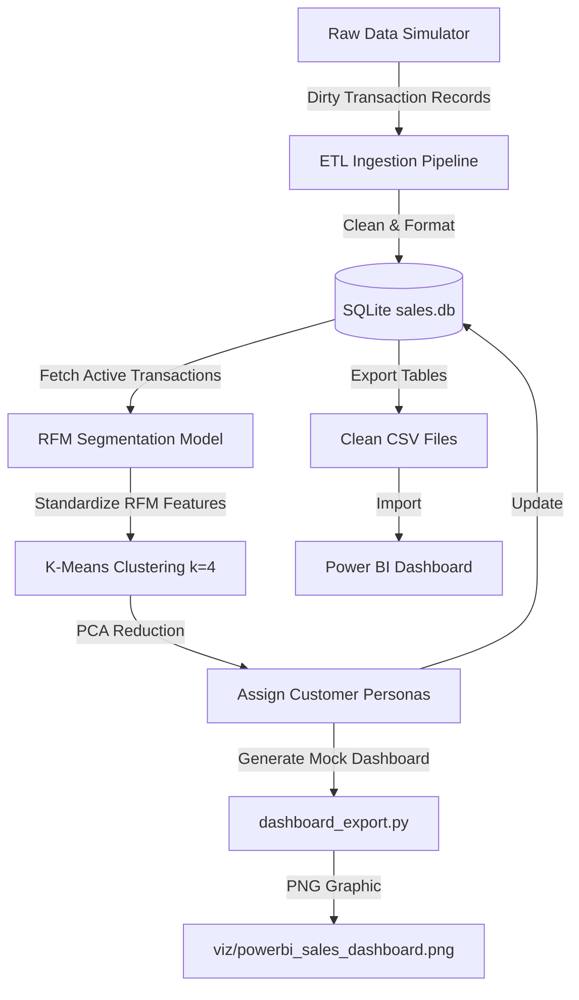

# Sales Analytics & RFM Customer Segmentation Pipeline

A modular, end-to-end data engineering and machine learning portfolio project that simulates sales transaction history, cleanses and processes the data through an ETL pipeline, segmentizes customers using K-Means clustering, and exports clean datasets ready for Power BI dashboard integration.

---

## 🏗️ Project Architecture

The pipeline follows a modern star schema data warehousing design:



---

## 📁 Repository Structure

```text
Sales-Customer-Segmentation-Pipeline/
├── data/
│   ├── sales.db                    # SQLite target database (git-ignored)
│   ├── dim_customers.csv           # Customer dimension for Power BI (git-ignored)
│   ├── dim_products.csv            # Product dimension for Power BI (git-ignored)
│   └── fact_sales.csv              # Sales facts for Power BI (git-ignored)
├── db/
│   ├── schema.sql                  # Database schema definitions
│   └── queries.sql                 # SQL analytical performance queries
├── etl/
│   └── pipeline.py                 # Simulation and ETL ingestion pipeline
├── models/
│   ├── segmentation.py             # RFM K-Means clustering model script
│   └── rfm_model.pkl               # Serialized cluster and scaling weights
├── viz/
│   ├── dashboard_export.py         # Matplotlib dashboard visual export
│   └── powerbi_sales_dashboard.png # Dark-mode dashboard preview mockup
├── requirements.txt                # Python package dependencies
└── README.md                       # Documentation & Power BI guide
```

---

## 🛢️ Database Star Schema

The project uses an SQLite star schema database designed for fast analytical queries:

### 1. `dim_customers` (Dimension Table)
* `customer_id` (INTEGER, PK): Unique customer identification.
* `customer_name` (TEXT): Customer full name.
* `email` (TEXT): Unique email.
* `segment` (TEXT): Assigned customer persona ("VIP Champions", "Loyal Customers", "New Customers", "At Risk / Hibernating").
* `joined_date` (DATE): Date customer registered.
* `pca_1`, `pca_2` (REAL): Coordinates generated by PCA for 2D graphing.

### 2. `dim_products` (Dimension Table)
* `product_id` (INTEGER, PK): Unique product identification.
* `product_name` (TEXT): Product full name.
* `category` (TEXT): Category grouping (e.g., Electronics, Apparel, Home & Kitchen, Books).
* `price` (REAL): Unit price of the item.

### 3. `fact_sales` (Fact Table)
* `sale_id` (INTEGER, PK): Unique transaction identifier.
* `customer_id` (INTEGER, FK): Links to `dim_customers.customer_id`.
* `product_id` (INTEGER, FK): Links to `dim_products.product_id`.
* `units_sold` (INTEGER): Number of items purchased.
* `total_price` (REAL): Revenue generated (`units_sold` * product price).
* `sale_date` (DATE): Date of purchase.

---

## ⚙️ Installation & Usage

### Prerequisites
Make sure you have **Python 3.8+** installed.

### 1. Install Dependencies
```bash
pip install -r requirements.txt
```

### 2. Run the ETL Ingestion Pipeline
Generates 180 days of daily transactions with a Pareto distribution (20% of customers driving 80% of sales), handles data cleaning (imputing nulls, correcting prices, formatting dates), and creates the database.
```bash
python etl/pipeline.py
```

### 3. Run the Customer Segmentation Model
Computes Recency, Frequency, and Monetary (RFM) metrics, scales features, runs K-Means (k=4 clusters), performs PCA for mapping, updates customer segments in SQLite, and serializes the model.
```bash
python models/segmentation.py
```

### 4. Export the Dashboard Graphic & CSVs
Generates a dark-themed Matplotlib visualization showing segment clusters, revenue trends, and category distribution. It also exports the SQLite tables to local CSVs for Power BI ingestion.
```bash
python viz/dashboard_export.py
```

---

## 🤖 RFM Segmentation & K-Means Clustering

Customer clustering is performed using **Recency**, **Frequency**, and **Monetary** value:
1. **Recency ($R$)**: Days elapsed since the customer's last purchase.
2. **Frequency ($F$)**: Cumulative number of transactions made by the customer.
3. **Monetary ($M$)**: Total revenue value driven by the customer.

### Machine Learning Workflow
* **Scaling**: Since Recency is measured in days, and Monetary can be in thousands of dollars, features are standardized to a mean of 0 and variance of 1 using `StandardScaler` to prevent feature dominance.
* **Clustering**: A K-Means algorithm ($k=4$) isolates specific customer groupings.
* **Persona Mapping**:
  * 👑 **VIP Champions**: High spending value, high order frequency, and very recent purchases.
  * 🔄 **Loyal Customers**: Moderate/high spending, consistent purchasing patterns, and moderate recency.
  * 🌱 **New Customers**: Low recency (recently purchased) but low frequency/monetary value.
  * ⚠️ **At Risk / Hibernating**: High recency (dormant for a long time) with low spending and transaction counts.
* **Dimension Reduction**: Principal Component Analysis (PCA) maps the 3D RFM metrics down to a 2D plane (`pca_1`, `pca_2`) for visualization.

---

## 📊 Power BI Dashboard Ingestion Guidelines

To build an interactive Power BI dashboard utilizing the pipeline's output, follow these instructions:

### Step 1: Import the Cleaned CSV Files
1. Open **Power BI Desktop**.
2. Click **Get Data** on the Home tab ribbon and select **Text/CSV**.
3. Navigate to the `data/` folder of this repository.
4. Import the three generated CSV tables:
   * [dim_customers.csv](file:///g:/Sales-Customer-Segmentation-Pipeline/data/dim_customers.csv)
   * [dim_products.csv](file:///g:/Sales-Customer-Segmentation-Pipeline/data/dim_products.csv)
   * [fact_sales.csv](file:///g:/Sales-Customer-Segmentation-Pipeline/data/fact_sales.csv)
5. Click **Load** to ingest the tables directly.

### Step 2: Establish Schema Relationships
1. Navigate to the **Model View** (represented by the hierarchy diagram icon on the left-hand navigation pane).
2. Connect the dimension tables to the fact table to define your star schema:
   * Drag `customer_id` from **dim_customers** to `customer_id` in **fact_sales**. 
     * *Relationship properties: 1-to-many ($1:\text{*}$), Single direction, Active.*
   * Drag `product_id` from **dim_products** to `product_id` in **fact_sales**. 
     * *Relationship properties: 1-to-many ($1:\text{*}$), Single direction, Active.*
3. Verify that the flow direction goes from the dimension tables pointing down to the fact table.

### Step 3: Configure DAX Measures (Optional but Recommended)
For dynamic summaries, add these DAX measures to your table:
* **Total Revenue**: `Total Revenue = SUM(fact_sales[total_price])`
* **Total Orders**: `Total Orders = DISTINCTCOUNT(fact_sales[sale_id])`
* **Customer Count**: `Customer Count = DISTINCTCOUNT(dim_customers[customer_id])`
* **Average Order Value (AOV)**: `AOV = [Total Revenue] / [Total Orders]`

### Step 4: Build Visualizations
1. **PCA Segment Cluster Chart**: Insert a **Scatter Chart**. Drag `dim_customers[pca_1]` to the X-Axis, `dim_customers[pca_2]` to the Y-Axis, and `dim_customers[segment]` to the Legend. This will perfectly match the clustering distribution generated by Python.
2. **Monthly Growth Trend**: Insert a **Line Chart**. Drag `fact_sales[sale_date]` (grouped by Month) to the X-Axis, and your `Total Revenue` measure to the Y-Axis.
3. **Category Revenue share**: Insert a **Treemap** or **Stacked Bar Chart**. Drag `dim_products[category]` to the Group/Legend, and `Total Revenue` to Values.
4. **Customer Persona Slicer**: Add a **Slicer** visual using `dim_customers[segment]` to let users filter the entire dashboard by segment.

*(Use the visual exported at [viz/powerbi_sales_dashboard.png](file:///g:/Sales-Customer-Segmentation-Pipeline/viz/powerbi_sales_dashboard.png) as a reference UI blueprint for formatting colors, fonts, and dark-theme layout properties.)*
